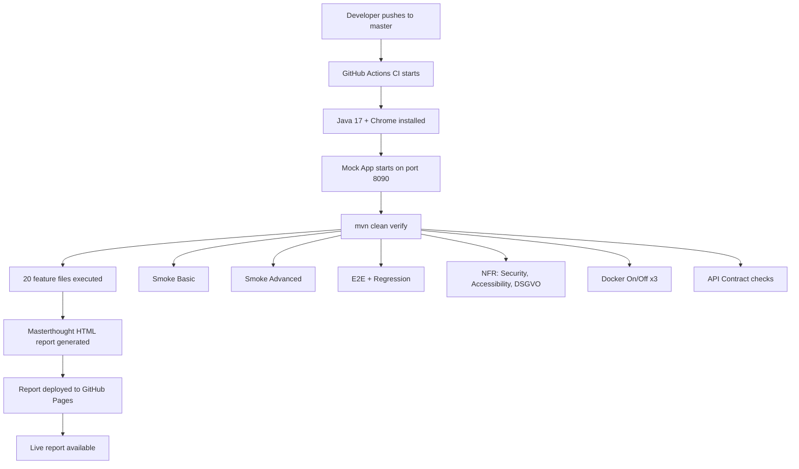

# TechDeck CoreSuite — Test Infrastructure

Simple overview of how the automatic tests work.

---

## Live Links

- [GitHub Repository](https://github.com/PinoLopez/java) — Source code
- [CI Pipeline](https://github.com/PinoLopez/java/actions) — Auto-test runs
- [Live Test Report](https://pinolopez.github.io/java/overview-features.html) — Test results
- [Mock App Demo](https://pinolopez.github.io/java/mock-app/) — Test target
- [GitHub Pages Deployments](https://github.com/PinoLopez/java/deployments) — Auto-deploy history

---

## Infrastructure Diagram

---

*TechDeck CoreSuite — Test Infrastructure | QA Engineer: Juan Pino | April 2026*